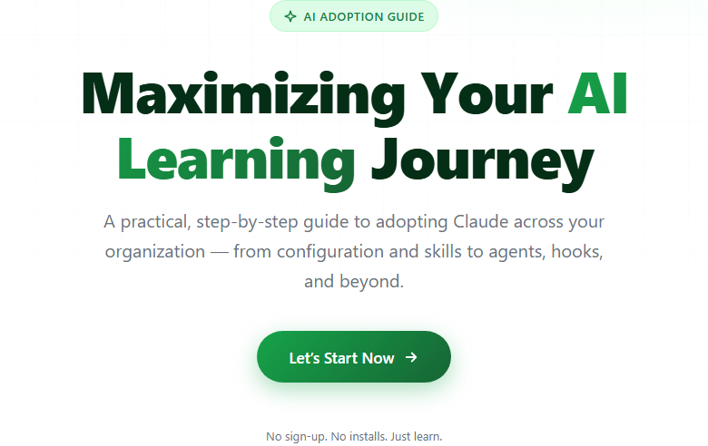

# AI Learning Journey

A documentation-style static tutorial website: **"Maximizing Your AI Learning Journey"** — a practical guide to adopting Claude across your organization, from configuration and skills to agents, hooks, and beyond.

Built with pure HTML, CSS, and vanilla JavaScript. No frameworks, no dependencies, no build step, no server.



## Quick start

Double-click `index.html` — that's it. The site runs directly from disk (`file://`).

Optionally serve it:

```bash
python -m http.server 8000
# then open http://localhost:8000
```

## Features

- **Landing page** — clean hero with a single call-to-action
- **Tutorial layout** — collapsible tree menu on the left, content on the right
- **33 topics in 7 sections** — from broad concepts down to micro level
- **Hash routing** — every topic is bookmarkable (`tutorial.html#/hooks`)
- **Prev/Next navigation** on every page
- **Fully responsive** — off-canvas drawer menu below 900px
- **Learn-more boxes** — curated YouTube videos and official docs per topic
- No images (inline SVG only), green theme throughout

## Project structure

```
ai-learning-journey/
├── index.html            Landing page (hero + "Let's Start Now")
├── tutorial.html         Tutorial shell: topbar, sidebar, content pane
├── assets/
│   ├── css/
│   │   ├── base.css      Reset, CSS variables (green palette), shared styles
│   │   ├── home.css      Hero page styles
│   │   └── tutorial.css  Sidebar tree, content, tables, responsive rules
│   ├── js/
│   │   ├── topics.js     ALL topic content (data only — edit here)
│   │   ├── nav.js        Builds the sidebar tree, drawer toggle
│   │   └── router.js     Hash routing, content render, prev/next
│   └── home-hero.png     Home page screenshot (used in this README)
├── CLAUDE.md             Instructions for Claude Code sessions
└── .claude/
    └── skills/
        └── add-topic/
            └── SKILL.md  Playbook for adding a new topic
```

## Tutorial contents

| Section | Topics |
|---------|--------|
| Getting Started | Welcome & Vision · Goals · Ecosystem at a Glance |
| Claude Fundamentals | Claude Code · Projects · Context Window · Claude API · Cowork |
| Configuration | CLAUDE.md · Settings & claude.json · Settings Scopes · .claude/ Folder |
| Automation & Extensibility | Hooks · Skills & SKILL.md · Plugins · MCP · Tools · Evals |
| Agents & Subagents | What is an Agent · Agent Loop · Subagents · Agent vs Subagent · Managed Agents · Skill vs Agent · When to Use Which · Loop vs Tool vs MCP vs Subagent |
| Workflow Features | Code Review · Claude Design & Artifacts · Caveman Mode · Shortcuts & Input Prefixes · MarkItDown |
| Learning Resources | Official Anthropic Resources · Community Channels |

## Adding a topic

All content lives in `assets/js/topics.js` as a `TOPICS` array. Add a child object with `id`, `title`, and `html` — the sidebar and routing update automatically. Full pattern documented in `.claude/skills/add-topic/SKILL.md`.

## License

Open for all — free to use, copy, modify, and share for any purpose. Video and documentation links belong to their respective owners.
